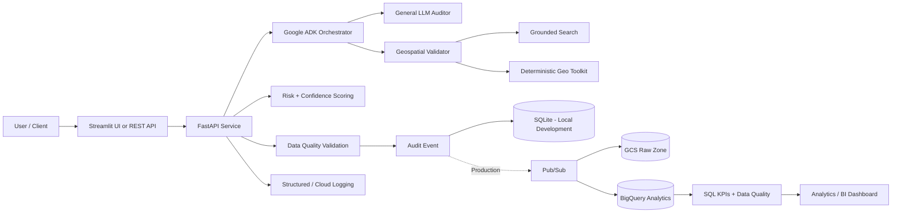

# LLM Auditor Platform
## An End-to-End Google Cloud AI, Data Engineering & Analytics Portfolio Project

[](https://www.python.org/)
[](https://cloud.google.com/)
[](https://google.github.io/adk-docs/)
[](https://fastapi.tiangolo.com/)
[](https://www.terraform.io/)
[](LICENSE)

> **Project goal:** Build a production-style platform that checks whether AI-generated claims are accurate, records every audit as structured data, measures system quality and risk, and makes the results available through APIs and analytics.

This project began as a Google Cloud Skills Boost exercise and was expanded into a complete portfolio project that demonstrates skills used in **Data Engineering, Data Analytics, Data Science, AI/ML Engineering, Cloud Engineering, and MLOps**.

---

## 1. What does this project do?

Large language models can generate convincing answers that are sometimes incorrect. This system acts as an **auditor** for those answers.

For example, suppose an AI says:

> "Paris is about 900 km from London."

Instead of asking another AI model to guess whether that number is correct, this project calculates the distance using the **Haversine formula**. The system then returns a structured verdict such as:

```json
{
  "verdict": "Inaccurate",
  "confidence": 0.99,
  "corrected_value": 343.6,
  "risk_score": 0.40
}
```

The audit is also stored as data so the platform can answer questions such as:

- How many claims were checked today?
- What percentage were inaccurate?
- Which claims have the highest risk?
- How confident is the system?
- How long does each audit take?
- Is the quality of the system improving over time?

That combination of **AI + APIs + data pipelines + analytics + cloud infrastructure** is the main purpose of this project.

---

## 2. Why this is a strong portfolio project

Many AI projects stop after calling an LLM API. This repository goes further by showing how an AI feature can become a real software and data platform.

| Career Area | What this project demonstrates |
|---|---|
| **Data Engineering** | Event ingestion, schemas, data-quality checks, SQLite warehouse, BigQuery architecture, Pub/Sub, GCS, SQL transformations |
| **Data Analyst** | KPI definitions, analytical SQL, API metrics, verdict distributions, confidence/risk analysis, latency metrics, dashboard-ready data |
| **Data Scientist** | Feature engineering, interpretable risk scoring, confidence scoring, golden datasets, model/evaluation thinking |
| **AI/ML Engineer** | Google ADK agents, Gemini/Vertex AI readiness, deterministic tools, evaluation, FastAPI model serving, structured outputs |
| **Cloud / MLOps** | Docker, Terraform, Cloud Run, Cloud Build, logging, CI/CD, health checks, reproducible environments |

A recruiter can therefore view the same project from several job perspectives instead of seeing it as only another chatbot demo.

---

## 3. System architecture



### The flow in plain English

1. A user submits a claim to the API or UI.
2. The orchestrator decides which specialist should handle it.
3. The appropriate agent researches or validates the claim.
4. Numeric geographic claims are checked with deterministic Python calculations.
5. The system produces a typed verdict with confidence and risk values.
6. Data-quality rules validate the audit event.
7. The event is stored for analysis.
8. Analytics endpoints and SQL summarize system behavior.
9. The cloud architecture can move those events through Pub/Sub, GCS, and BigQuery.

For deeper design details, see [`docs/ARCHITECTURE.md`](docs/ARCHITECTURE.md).

---

## 4. Main features

### Multi-agent AI auditing

The project uses **Google Agent Development Kit (ADK)** to separate responsibilities instead of putting every task into one giant prompt.

The system includes:

- an orchestration layer,
- a general fact-auditing path,
- a geography-specific validation path,
- grounded research,
- deterministic numeric tools.

This architecture makes the project easier to test, maintain, and extend.

### Deterministic geographic validation

The `geo_toolkit.py` module validates coordinates and calculates great-circle distance using the Haversine formula.

This is important because mathematical or numeric facts should not depend entirely on an LLM's reasoning.

### Structured API contracts

Pydantic models in `core/schemas.py` define consistent request, evidence, verdict, and audit-event formats.

A structured output can be stored, queried, evaluated, visualized, or consumed by another application more reliably than free-form text.

### Data-quality gates

Before audit events are stored, `analytics/quality.py` verifies properties such as:

- valid audit IDs,
- recognized verdict values,
- confidence and risk ranges,
- non-negative latency,
- evidence requirements.

This introduces an important Data Engineering concept: **bad data should be caught before it reaches analytics systems**.

### Analytics event pipeline

Every verification generates an event with fields such as:

- audit ID,
- pipeline,
- verdict,
- confidence,
- risk score,
- latency,
- evidence count,
- input length,
- deviation values.

`data_pipeline/warehouse.py` stores these events locally using SQLite, while the production design maps the same idea to BigQuery.

### Risk and confidence scoring

`ml/risk_model.py` creates interpretable features such as:

- numeric deviation,
- amount of evidence,
- claim length,
- whether deterministic validation was available.

The current model is intentionally understandable and can later be replaced with a trained classifier deployed through Vertex AI.

### Evaluation framework

The repository includes a **golden dataset** and regression evaluator.

This allows prompt, model, or code changes to be tested against known expected answers rather than judging improvements manually.

### Analytics and KPIs

The platform calculates metrics including:

- total audits,
- accurate vs. inaccurate claims,
- average confidence,
- average risk score,
- evidence depth,
- mean latency,
- p50 latency,
- p95 latency.

BigQuery-ready SQL is available under `sql/`.

### Cloud infrastructure

Terraform files demonstrate infrastructure-as-code for:

- Cloud Run,
- Cloud Storage,
- BigQuery,
- Pub/Sub,
- required Google Cloud APIs.

`cloudbuild.yaml` provides a path toward automated container build and deployment.

---

## 5. Technologies used

### Programming and application layer

- Python 3.10+
- FastAPI
- Pydantic
- Streamlit
- Pytest

### AI / ML

- Google Agent Development Kit
- Gemini / Vertex AI-ready architecture
- tool-using AI agents
- structured AI outputs
- deterministic validation
- feature engineering
- risk scoring
- regression evaluation

### Data Engineering and Analytics

- SQLite
- BigQuery-ready SQL
- Pub/Sub architecture
- Google Cloud Storage raw zone
- data-quality validation
- analytical KPIs

### DevOps / Cloud

- Docker
- Docker Compose
- Terraform
- Google Cloud Run
- Google Cloud Build
- GitHub Actions
- structured logging

---

## 6. Repository structure

```text
llm-auditor-platform/
│
├── api/                     # FastAPI endpoints
├── analytics/               # Data-quality logic
├── core/                    # Pydantic schemas and contracts
├── data_pipeline/           # Event ingestion / local warehouse
├── evaluation/              # Golden dataset + evaluator
├── geo_validator/           # Geography AI validation pipeline
├── llm_auditor/             # General AI fact-auditing pipeline
├── ml/                      # Risk and confidence scoring
├── orchestrator/            # Agent routing layer
├── scripts/                 # Utility and demo-data scripts
├── sql/                     # BigQuery analytics + quality queries
├── terraform/               # Google Cloud infrastructure as code
├── tests/                   # Automated tests
├── ui/                      # Streamlit application
│
├── callback_logging.py      # Structured logging utilities
├── geo_toolkit.py           # Deterministic geographic calculations
├── cloudbuild.yaml          # Google Cloud CI/CD deployment config
├── Dockerfile
├── docker-compose.yml
├── Makefile
└── README.md
```

---

## 7. How to run the project locally

### Prerequisites

Install:

- Python 3.10 or newer
- Git
- Docker Desktop (optional but recommended)

For live Gemini/Vertex AI functionality, you will also need appropriate Google credentials.

### Step 1 — Clone the repository

```bash
git clone https://github.com/Jashwanth248/AI_Agets-.git
cd AI_Agets-
```

### Step 2 — Create a Python environment

macOS / Linux:

```bash
python -m venv .venv
source .venv/bin/activate
```

Windows PowerShell:

```powershell
python -m venv .venv
.venv\Scripts\Activate.ps1
```

### Step 3 — Install dependencies

```bash
pip install -r requirements-dev.txt
```

### Step 4 — Create your environment file

```bash
cp .env.example .env
```

Do **not** commit real credentials to GitHub.

### Step 5 — Run automated tests

```bash
make test
```

### Step 6 — Run the evaluation suite

```bash
make eval
```

### Step 7 — Start the API

```bash
make api
```

Open:

```text
http://localhost:8000/docs
```

FastAPI automatically provides an interactive Swagger interface where you can test the endpoints.

### Step 8 — Start the dashboard

In another terminal:

```bash
make ui
```

### Alternative — Docker

```bash
docker compose up --build
```

---

## 8. Example: verify a distance claim

Send this request:

```bash
curl -X POST http://localhost:8000/v1/verify/distance \
  -H "Content-Type: application/json" \
  -d '{
    "question": "How far is Paris from London?",
    "claim": "Paris is about 900 km from London.",
    "lat1": 48.8566,
    "lon1": 2.3522,
    "lat2": 51.5074,
    "lon2": -0.1278,
    "claimed_distance_km": 900,
    "tolerance_pct": 10
  }'
```

Example result:

```json
{
  "verdict": "Inaccurate",
  "confidence": 0.99,
  "risk_score": 0.4,
  "corrected_value": 343.6,
  "evidence": [
    {
      "source_type": "deterministic",
      "source": "geo_toolkit.haversine_distance_km"
    }
  ]
}
```

The important idea is that the numeric answer is produced by a deterministic function rather than by asking the LLM to estimate the distance.

---

## 9. Explore the analytics layer

Generate sample audit events:

```bash
make demo-data
```

Request KPI data:

```bash
curl http://localhost:8000/v1/analytics/summary
```

Inspect recent audit events:

```bash
curl 'http://localhost:8000/v1/events?limit=20'
```

The SQL directory contains examples that can be adapted for BigQuery dashboards and reporting.

---

## 10. Testing and software quality

Useful commands:

```bash
make test
make test-cov
make lint
make typecheck
make eval
make validate
```

The project is designed so core deterministic functionality can be tested without requiring a live model call.

That makes CI faster and helps separate normal software bugs from model behavior.

---

## 11. Google Cloud production design

The local version uses lightweight components so anyone can learn from the repository without immediately paying for cloud resources.

The production design maps those components to managed Google Cloud services:

| Local / Development | Production Google Cloud equivalent |
|---|---|
| FastAPI process | Cloud Run |
| SQLite event warehouse | BigQuery |
| Local event writes | Pub/Sub event pipeline |
| Local/raw files | Cloud Storage raw zone |
| Local logs | Cloud Logging |
| Manual infrastructure | Terraform |
| Local Docker build | Cloud Build |
| AI model access | Gemini / Vertex AI |

This pattern makes the project educational locally while still demonstrating how a production cloud system would be designed.

---

## 12. Deploying with Terraform

Example:

```bash
cd terraform
terraform init

terraform plan \
  -var="project_id=YOUR_PROJECT_ID" \
  -var="image=us-central1-docker.pkg.dev/YOUR_PROJECT_ID/portfolio/llm-auditor:latest"

terraform apply
```

Review Terraform plans carefully before applying them because Google Cloud resources may create charges.

---

## 13. What I learned by building this project

This project demonstrates the transition from a guided cloud lab to a larger engineering system.

Key learning outcomes include:

1. **AI applications need deterministic tools.** LLMs should not be trusted for every type of calculation.
2. **AI outputs should be structured.** Typed outputs are easier to test and integrate into downstream systems.
3. **AI systems generate valuable operational data.** Model outputs, confidence, risk, evidence, and latency can become an analytics pipeline.
4. **Data quality matters before analytics.** Invalid events should not silently enter the warehouse.
5. **Evaluation is part of engineering.** A golden dataset makes model and prompt changes measurable.
6. **Local and production architectures can share one design.** SQLite can support development while BigQuery represents the production warehouse.
7. **Infrastructure should be reproducible.** Terraform and Docker make the project easier to deploy and review.

---

## 14. How this project maps to job interviews

### For a Data Engineer interview

I would focus on:

- the event schema,
- ingestion flow,
- data-quality gates,
- warehouse design,
- BigQuery SQL,
- Pub/Sub + GCS architecture,
- Terraform and cloud deployment.

### For a Data Analyst interview

I would focus on:

- KPI definitions,
- accurate/inaccurate distributions,
- confidence and risk trends,
- latency analysis,
- analytical SQL,
- how audit data can support BI dashboards.

### For a Data Scientist interview

I would focus on:

- risk features,
- confidence interpretation,
- evaluation datasets,
- error analysis,
- how the current deterministic score could evolve into a trained classifier.

### For an AI/ML Engineer interview

I would focus on:

- agent orchestration,
- grounded research,
- deterministic tool calling,
- structured outputs,
- FastAPI serving,
- evaluation,
- Docker and Cloud Run deployment.

See [`docs/PORTFOLIO.md`](docs/PORTFOLIO.md) for additional resume and interview guidance.

---

## 15. Suggested future improvements

Possible next versions include:

- a live Pub/Sub consumer that streams events into GCS and BigQuery,
- dbt models and data tests,
- Apache Beam / Dataflow batch processing,
- Vertex AI model training and experiment tracking,
- MLflow model tracking,
- OpenTelemetry distributed tracing,
- model/prompt A/B testing,
- drift monitoring,
- RAG with vector search and citation evaluation,
- user authentication and role-based access,
- Looker Studio production dashboards.

These are deliberately listed as future improvements rather than being presented as already completed features.

---

## 16. Project origin

The original idea came from a **Google Cloud Skills Boost LLM Auditor lab**. The lab concepts were substantially redesigned and extended into this portfolio project with additional software engineering, data engineering, analytics, ML, testing, API, container, and infrastructure components.

The purpose is not simply to reproduce the lab. It is to demonstrate how a guided exercise can become an independent, production-oriented engineering project.

---

## 17. License

This repository uses the **Apache 2.0 License**. See [`LICENSE`](LICENSE).

---

## Author note

If you are a student studying this repository, a useful order is:

**README → `geo_toolkit.py` → `core/schemas.py` → `analytics/quality.py` → `data_pipeline/warehouse.py` → `ml/risk_model.py` → `api/main.py` → agent folders → SQL → Terraform.**

That path starts with the easiest deterministic code and gradually moves toward the AI and cloud architecture.
