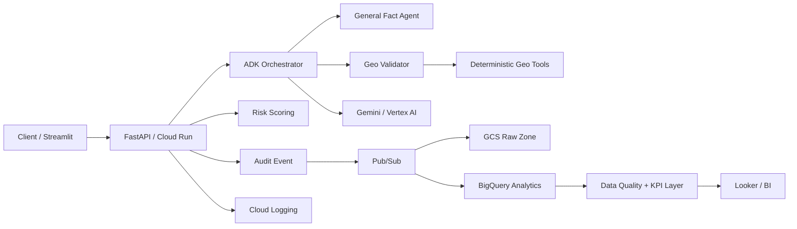

# Architecture

## Portfolio architecture

The repository deliberately supports a local SQLite warehouse so tests and demos do not require GCP. The Terraform design maps the same event model to GCS + BigQuery + Pub/Sub for a cloud deployment.

## Engineering decisions

- Deterministic numeric tools are used before LLM judgment when possible.
- Every audit emits an analytics event with latency, confidence, risk and evidence features.
- A data-quality gate checks events before persistence.
- The serving layer exposes structured Pydantic contracts suitable for downstream applications.
- Evaluation is executable in CI, making prompt/model changes measurable rather than subjective.
