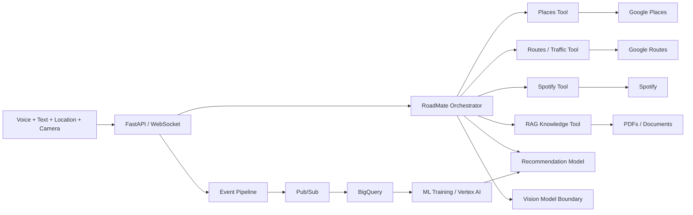

# RoadMate AI — Multimodal Agentic Mobility Assistant

RoadMate AI is an advanced AI engineering project that combines **real-time voice + text conversation, location intelligence, routing, recommendations, RAG, ML, music controls, data engineering, observability and cloud deployment** in one system.

The goal is not to create another chatbot. The goal is to build a personal assistant that can understand a request, decide which tools or models are needed, execute them, combine the results and respond naturally by text and voice.

## Example conversations

- “Find waterfalls near me and rank the best three.”
- “Find Indian food close to my current route.”
- “Route me there and tell me if traffic makes another route faster.”
- “Play relaxing music.”
- “What does this road sign mean?”
- “Search my uploaded driver handbook and explain the rule with evidence.”
- “What places do I usually prefer around this time of day?”

## Architecture



## Core capabilities

### Voice + text conversation
The included browser app supports microphone input, typed chat and spoken responses. The production architecture is ready for Gemini Live so audio/video/text can share a persistent real-time session.

### Agent/tool orchestration
The orchestrator interprets requests and invokes isolated Places, Routes, Spotify, RAG and recommendation tools. These interfaces can later be registered directly with Gemini tool calling or Google ADK.

### Nearby-place intelligence
Google Places integration can search restaurants, waterfalls, parks, coffee, fuel and other POIs using the user's coordinates. A recommendation layer ranks results instead of returning raw API order.

### Traffic-aware routing
Google Routes integration computes driving/walking/bicycle routes. Driving requests use a traffic-aware routing preference when live credentials are configured.

### RAG document assistant
Upload PDF/text documents and query them. The local version uses TF-IDF retrieval for a zero-cloud demo; production can swap in embeddings/vector search while preserving source metadata.

### Recommendation ML
The repo includes a supervised place-selection training pipeline. Real interaction events can later train a personalized ranker using distance, ratings, reviews, time and preference features.

### Computer-vision boundary
RoadMate is designed to accept road-sign/signal observations from a separate YOLO/CNN/TFLite model. This is an awareness/education feature and never an authoritative driving controller. See [`docs/SAFETY.md`](docs/SAFETY.md).

### Music control
Spotify integration supports search and playback-control integration points. OAuth/user permissions are externalized instead of committing tokens.

### Data engineering + MLOps
Structured agent events are written locally and designed to stream through Pub/Sub into BigQuery. This creates training/evaluation data for recommendation, ETA, intent and quality models.

## Run locally

```bash
git clone https://github.com/Jashwanth248/AI_Agets-.git
cd AI_Agets-/roadmate-ai
python -m venv .venv
source .venv/bin/activate
pip install -r requirements-dev.txt
pytest -q
uvicorn app.main:app --reload --port 8080
```

Open `http://localhost:8080`, allow browser location/microphone access, and use either the text box or **Talk** button.

No API key is required for the local demo; external tools return demo results when credentials are absent.

## Connected mode

Set environment variables locally (never commit secrets):

```text
GOOGLE_MAPS_API_KEY=...
GEMINI_API_KEY=...
SPOTIFY_ACCESS_TOKEN=...
```

## API surface

- `POST /v1/chat` — text/tool orchestration
- `WS /ws/assistant` — low-latency conversational channel
- `POST /v1/route` — traffic-aware routing integration
- `POST /v1/rag/ingest` — PDF/text ingestion
- `POST /v1/rag/query` — grounded retrieval
- `GET /metrics` — Prometheus metrics
- `GET /healthz` — health check

## Production roadmap

- direct Gemini Live bidirectional audio/video bridge
- Google ADK tool registration and memory
- Vertex AI Vector Search / pgvector RAG
- Pub/Sub producer + Dataflow streaming transforms
- BigQuery feature tables and dbt models
- XGBoost personalization from real event data
- YOLO road-sign model + TensorFlow Lite mobile export
- offline/edge mode
- Android/Flutter client with Navigation SDK
- OAuth 2.0 account linking for Spotify
- OpenTelemetry traces and model/tool quality dashboards
